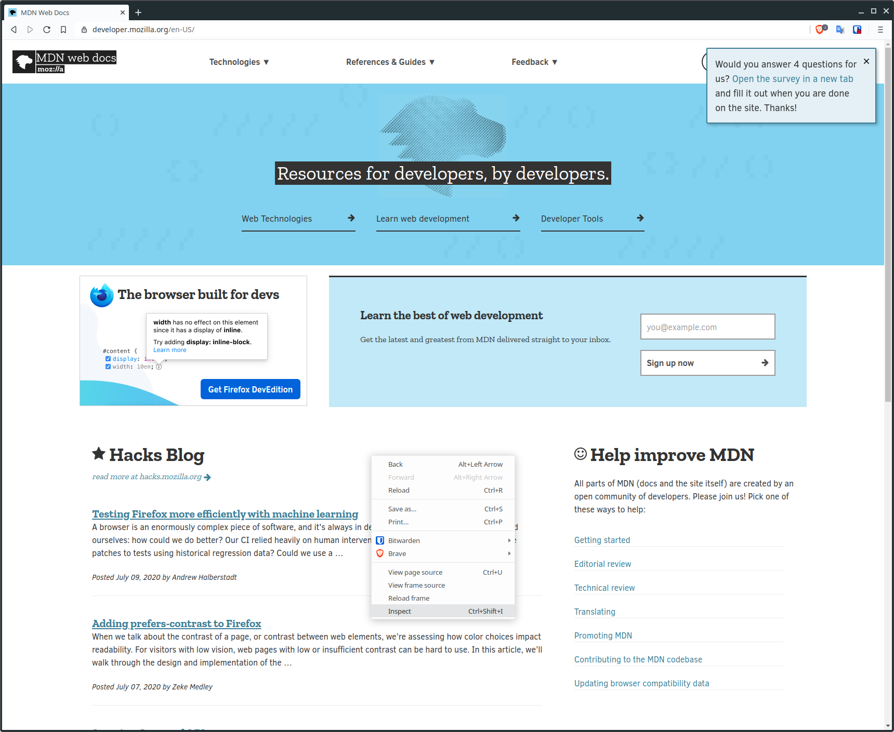
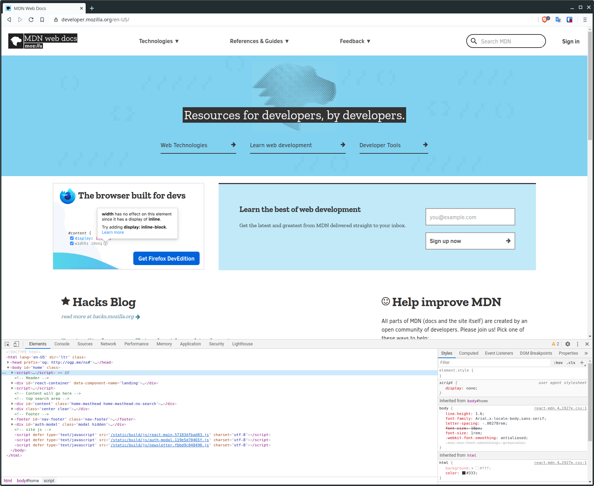
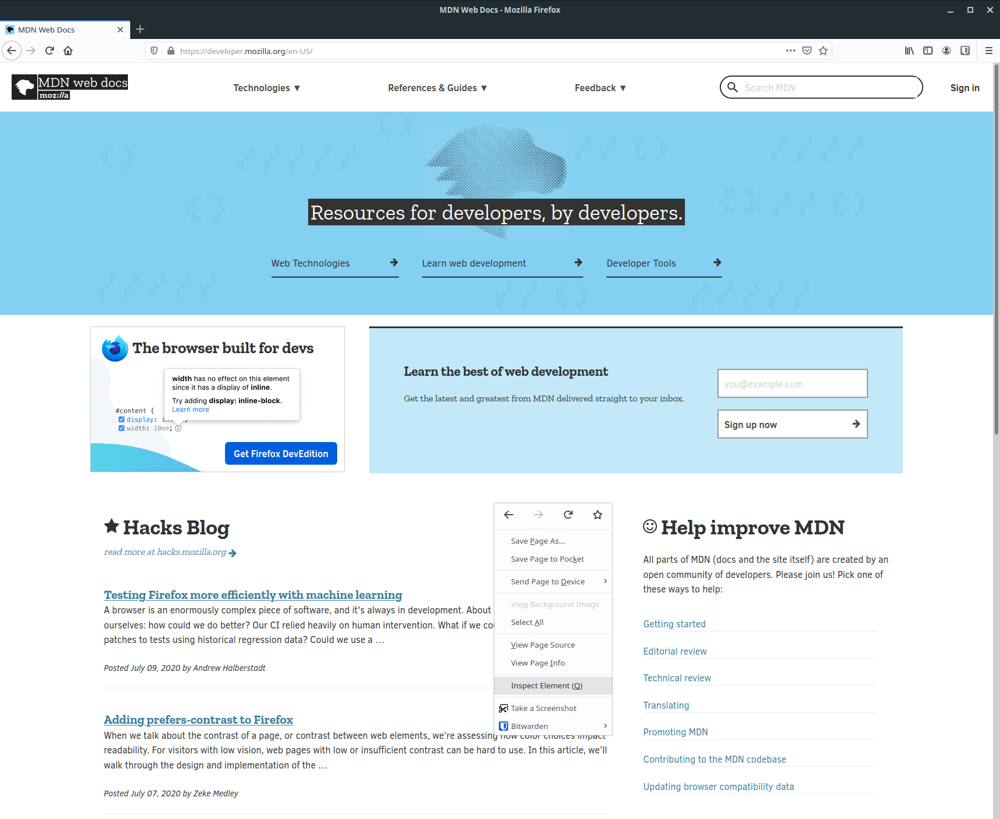
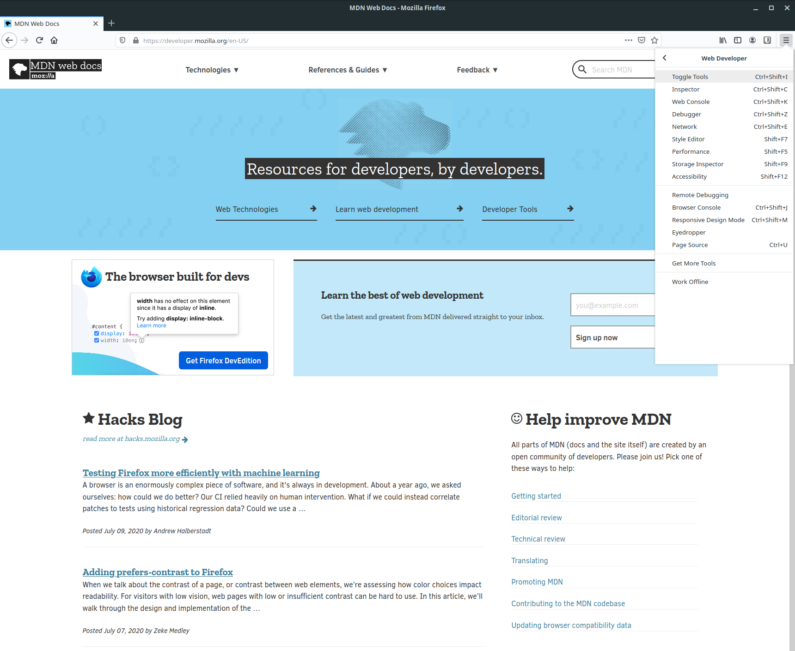
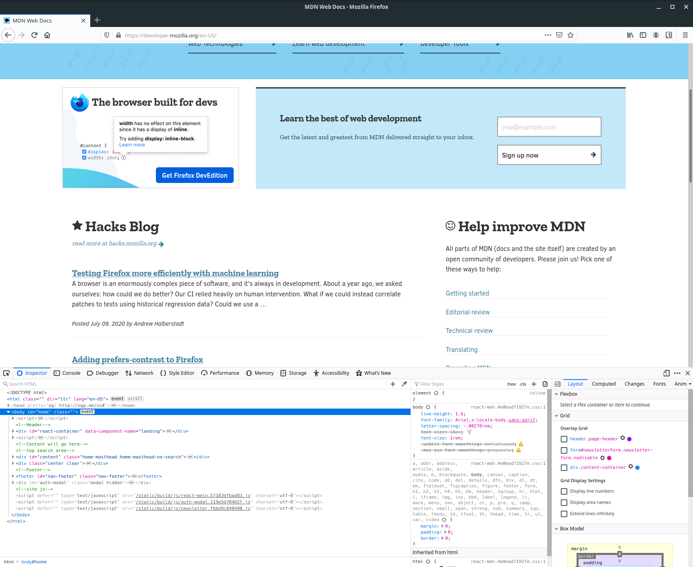

# The Browser Inspector: using the developer tools

When developing web sites and web applications, we use a number of tools to help us during the development process. One of the most important tools in our toolbox is the browser itself, and every major browser includes a suite of development tools that we can use.

These development tools allow us to add and remove elements on the fly, modify styles, and even view detailed performance information for the page.

::: warning Making changes through the developer tools
When using the developer tools, we're not actually modifying any files when we change the page layout or styles. If you make some changes and then refresh the page, the original HTML document will be loaded, which doesn't include any of the changes you've made.

This means that you're free to play around and make any changes you like, but it also means you can easily lose your work once you find something you like.
:::

## Opening the developer tools

In Chrome, Chromium, and Brave you can simply right click somewhere on the page and select "Inspect" from the dropdown menu.

If you prefer to use keyboard shortcuts, you can press either `F12` or `ctrl` + `shift` + `i`.

regardless of which method you choose, you'll be presented with something like this:

On Firefox, the process is fairly similar. You can right click anywhere on the page and click "Inspect Element".

Alternatively, you can access the developer tools from the main menu. First click the three horizontal lines in the top right corner of the interface, then click the "Web Developer" item in the menu.

This will open another menu where you'll be able to click "Toggle Tools".

The `F12` and `ctrl` + `shift` + `i` shortcuts also work in Firefox.

The developer tools look very similar to those in Chrome:

::: tip Other browsers
The process should be fairly similar in other browsers. If you're not able to find the developer tools for your browser, try Googling the browser name plus "developer tools". You should be able to find a tutorial.

If you're still having trouble, get in touch on our [Discord server](https://discord.gg/BBWwyMq). We'd be happy to help!
:::
