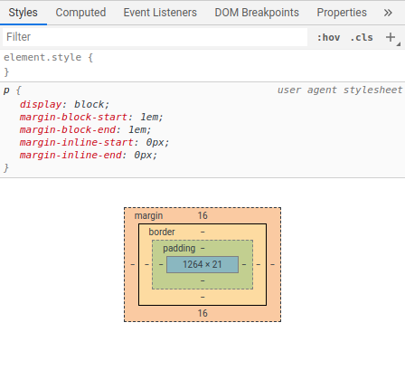
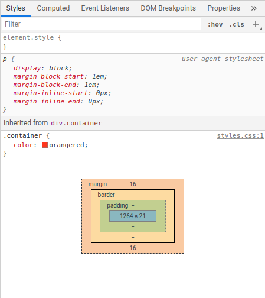

# Inheritance in CSS

Inheritance is an important concept and a powerful tool which we can leverage when writing CSS code. Inheritance allows us to write less code, reduce repetition, and make our stylesheets easier to maintain.

Writing less code also bring us a performance benefit in web development, since smaller stylesheets are downloaded and parsed more quickly by the browser. This makes our pages load faster!

## What is inheritance in CSS

Inheritance is a feature which determines what happens when no value is set for a given property on an element.

Let's look at a simple example:

```html
<!DOCTYPE html>
<html lang="en">
<head>
    <meta charset="UTF-8">
    <meta name="viewport" content="width=device-width, initial-scale=1.0">
    <title>Inheritance Demonstration</title>
    <link rel="stylesheet" href="styles.css">
</head>
<body>
    <div class="container">
        <p>A simple paragraph...</p>
    </div>
</body>
</html>
```

Here we have some HTML boilerplate code where we link a single stylesheet called `styles.css`. The actual document contains very few elements. Note that the `<body>` contains a `<div>` and a `<p>` element.

If we open our developer tools and select the `<p>` element, we see that there are a few default styles being applied by the browser. For example, the `display` property is being set to `block`, and there are various `margin` properties being set.



One thing which isn't being set on the `<p>` element is a text colour. Instead of writing a property for the `<p>` element directly, we can instead set this on the parent `<div>`.

```css
.container {
    color: orangered;
}
```

If we reload the page, the text should now be coloured orange. There's also something interesting in our developer tools.



We have a new `color` property being applied to the `<p>` tag, and the Chrome developer tools is very usefully telling us that this property was inherited from the parent `<div>` with the `container` class.

This style was inherited because `color` is an inherited property, and the `<p>` element didn't have an existing defintion for this property being applied to the element.

:::tip Non-inherited properties
Not every property in CSS is inherited by default, and for some properties it simply doesn't make sense. We'll be looking at some examples in the next lecture.

You can find out whether a property is inherited by going to the documentation page for a given property on the MDN &mdash; [border, for example](https://developer.mozilla.org/en-US/docs/Web/CSS/border#Formal_definition). Every property lists whether or not any values set are inherited.
:::


If we also set a `color` value for the `<p>` element, the value we set for that attribute is used instead.

```css
.container {
    color: orangered;
}

p {
    color: blue;
}
```

Our `<p>` element no longer inherits the `color` property, because this property was already defined for the element.

## The `inherit` keyword

Sometimes we want an element to inherit some styles from a parent element, but the child element already has a default value for the property we want to inherit. For example, say we have an `<a>` element, and we want it to inherit the `color` property of some container.

By default, `<a>` elements get rendered in a shade of blue on most browsers, because there's a default set of styles being applied. Our `<a>` elements therefore won't inherit any text colours from their parent elements, since a value has already been set for this property on the element.

To get around this, we can overwrite the `color` property being applied to our `<a>` element, setting the value to `inherit`. This tells CSS that we want to explicitly inherit the parent's value for this particular property.

```css
a {
    color: inherit;
}
```

At this point, some of you are probably wondering, why not just set the value to be the same as the parent element directly? There are a few reasons why we should prefer `inherit`.

1) It makes it easier to make changes to our stylesheets. If we decide we want to change the colour of all the text in the container, we don't have to remember to update it for the `<a>` element as well.

2) Imagine we have several `<a>` elements inside different containers, and they have different text colours. In each case, say we want to have the same text colour as the container. By specifying the colours directly, we'd have to write styles for each set of colours. Using `inherit`, our `<a>` elements can share the same styles, because they will independently inherit property values from their respective parents.

3) The colour of our containers may change in response to some trigger. Using `inherit`, the colour of the `<a>` element will be updated as the container text colour changes. If we hardcoded the colours, we'd have to update each of the `<a>` elements when the container colours changed.

::: warning A note on interface design
While we've used the example of an `<a>` tag inheriting colours from a parent element, this is not something you'll want to do in practice. `<a>` elements are a different colour on purpose. It makes them stand out, so the user knows that the link is clickable.

Always keep usability in mind when creating your sites. Don't hide links and other interactive elements!
:::

We can use the `inherit` keyword for any properties, regardless of whether or not that property is an inherited property. The `inherit` keyword can therefore also be used to force inheritance of non-inherited properties.
