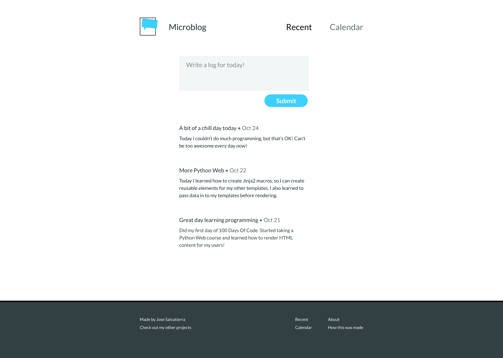

# Overview of this project

In this section we're going to make use of our HTML and CSS knowledge and start building a micro blog.

The main purpose of this project is to teach you all the main skills of building a software project. However, you'll also be able to use this project as a programming journal, to keep track of the things you're learning over time, in the form of small snippets of text.

Especially while you go through the course, I'd recommend using this project often! At the end of the course you'll have a nice timeline of everything you've learned!

## The project's user interface

The user interface of the project will look like this, once we're finished:

As you can see, there are four main parts to this project:

- The header with the "Recent" and "Calendar" links (we'll be building the Calendar page later in the course)
- A form for creating new entires
- A list of entries that you have already created
- A footer with some links and information

## What you'll learn by building this project

Building a complete project like this one requires quite a few skills! Let's talk about the main ones you'll be starting to learn in this section.

### How to run a software project

Most software projects start as an idea, and over time evolve into something more. You add features, come up with new improvements, change things following user requests, and much more.

Throughout the section we'll be learning a bit about Agile and how to run a software project so that you don't get too bogged down initially and so that you can keep motivation high and your users happy by incrementally developing your application.

### Some design

Through this project and all other projects in this course, I'll take you with me in the design journey for each application. Although this is not a design course, there will be some chapters that talk about the practicalities of designing an application, as well as information to become a better designer.

Even if your aim is not to be able to design webpages, knowing some design can be super helpful to understand other people's designs and also so you can make usable and appealing applications for yourself!

### More HTML and CSS

We have learned a bit about HTML and CSS already, and with this project we'll put that knowledge to the test. During our development we'll also learn more HTML and CSS that we'll need to implement the features of the application!

### What front-end and back-end mean

Up to now we've focused on front-end development: HTML and CSS.

Front-end is what clients interact with in any application. The façade or user interface. However, with only HTML and CSS we lack the ability to do things such as sharing data across multiple browsers (e.g. so two people in different parts of the world can see the same data on a webpage), storing things in a database, keeping track of user logins, and much more.

For those things, mostly concerned with data storage and transfer, we have back-end development.

Back-end is the part of an application that user's don't see directly, but is necessary for the data to flow from client (user) to server and database.

### How to code a back-end application with Flask

Of course, you won't only learn the differences between front-end and back-end theoretically. We'll be coding a back-end for this application so that we can connect the HTML and CSS to a database and store the blog entries permanently!

## Conclusion

We have a lot to learn in this section. Let's get started!