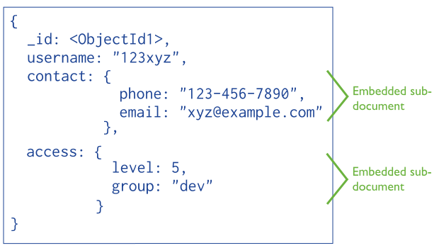

# Introduction to MongoDB

MongoDB[^mongodb] is a document-oriented NoSQL database used for high volume data storage.

NoSQL[^nosql] databases (aka "not only SQL") are non-tabular and store data differently than relational tables. They come in a variety of types based on their data model. The main types are document, key-value, wide-column, and graph.

## How is It Different from SQL Databases?

Relational[^rdbms] databases like MySQL, PostgreSQL primarily use tables, rows, and columns to store data in rigid schemas. MongoDB doesn't use these constructions; instead, it employs a document-driven NoSQL data model. It provides flexible schemas and scales effortlessly with large amounts of data and high user loads.

## Key Components of MongoDB Architecture

MongoDB stores data in **documents** similar to **JSON** (JavaScript Object Notation) objects. Each document belongs to a specific **collection** and contains pairs of fields and values. The values can typically be a variety of types like strings, numbers, booleans, arrays, or objects, and their structures typically align with objects developers are working within code.

> If you're familiar with SQL databases, you can think of *collections* as tables and the *documents* as rows in the table.

The following diagram shows the anatomy of a MongoDB document:

Below are a few of the common terms used in MongoDB:

* **_id** – This is a field required in every MongoDB document. The *_id* field represents a unique value in the MongoDB document. It acts like the document's primary key. If you create a new document without an *_id* field, MongoDB will automatically create the field.

* **Collection** – This is a grouping of MongoDB documents. A collection exists within a single database. As seen from the introduction collections don't enforce any sort of structure.

* **Cursor** – This is a pointer to the result set of a query. Clients can iterate through a cursor to retrieve results.

* **Database** – This is a container for collections like in relational databases wherein it is a container for tables. Each database gets its own set of files on the file system. A MongoDB server can store multiple databases.

* **Document** - A record in a MongoDB collection is called a document. The document, in turn, will consist of field name and values.

* **Field** - A key-value pair in a document. A document has zero or more fields. Fields are analogous to columns in relational databases.

## Feature Sets

NoSQL databases like MongoDB offer many advantages[^mongo-features] over their SQL counterparts. Here's an overview of the features that aim to give you a glimpse of how MongoDB can make web development easier:

* The size and contents of each document can be different from each other. This flexibility in the data model often leads to faster development cadence.

* The documents don't need to have a schema defined beforehand. Instead, you can create the fields on the fly.

* The JSON-like document model is similar to how you construct classes and objects in different procedural programming languages.

* The data model available within MongoDB allows you to represent hierarchical relationships, to store arrays, and other more complex structures easily.

* MongoDB houses a powerful query language that makes it suitable to be used as a general-purpose database.

## Conclusion

In this section, you've got a basic overview of MongoDB and how NoSQL databases differ from their relational counterparts. Also, you've learned about the data model MongoDB uses and what features it offers that sets it apart from other databases.

In the next section, you'll learn how you can get up and running with MongoDB via MongoDB Compass and Atlas.

[^mongodb]: [What is MongoDB?](https://www.mongodb.com/what-is-mongodb)

[^nosql]: [NoSQL Explained](https://www.mongodb.com/nosql-explained#what-is-nosql)

[^rdbms]: [What is SQL?](https://www.mongodb.com/nosql-explained#what-is-sql)

[^mongo-features]: [MongoDB Features](https://www.guru99.com/what-is-mongodb.html#2)
