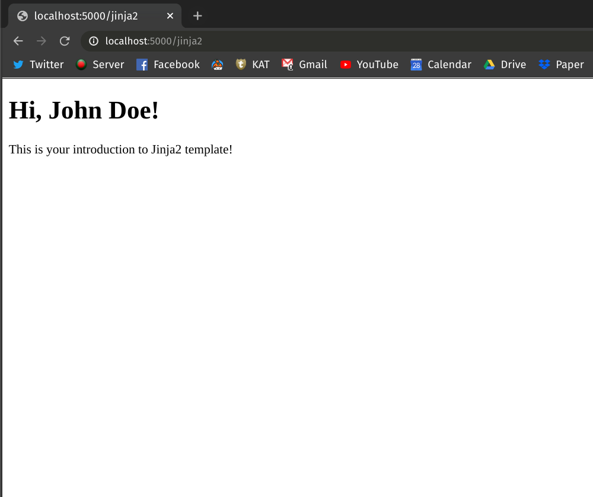

# What is Jinja2

## What is a Template Language

A template is a text file. It can generate any text-based format (HTML, XML, CSV, etc). It usually contains variables, which get replaced with values when the template is evaluated, and tags, which control the logic of the template.

The syntax used in a template is usually known as a template language and the underlying code that evaluates the template is called a template engine.

For example, the Django web framework has an embedded template language called the *Django Template Language*[^django-template-language]. Flask comes packaged with the powerful Jinja2[^jinja2] template language.


## Jinja2

Jinja, also commonly known as "Jinja2" to specify the newest release version, is a Python template engine often used to create HTML, XML or other markup formats that are returned to the users via an HTTP response. In our case, we'll mostly be creating HTML files from the templates.

::: tip
Jinja Templates are just `.html` files with the added Jinja code. By convention, they live in the `/templates` directory in a Flask project.
:::

## Why Use Jinja2

Jinja2 is a good choice because it's popular, has simple syntax and is an independent open-source project. It can be used as an external dependency by other code libraries, and it doesn't depend on Flask.

Unlike the Django Template Language which is tied to the Django ecosystem, you can use Jinja2 in any of your projects as a third party library.

## Introduction to Jinja2 Syntax

Jinja2 syntax can contain variables as well as some programming logic, which when evaluated (or rendered into HTML), are replaced with actual values.

The variables and/or logic are placed between tags or delimiters. Jinja templates use `` for expressions or logic (like `for` loops). Double curly braces `{​{ ... }​}` are used for outputting the results of an expression or a variable to the end user.

Let's take a quick look at a self-contained example. In this example, you'll use the `{​{ ...  }​}` syntax to interpolate values to a string. If you've already installed Flask in your current environment, Jinja2 should already be installed. If not, you can always install it to your current development environment via `pip install jinja2`.

<!-- Lines to highlight: 7, 12 -->

```python
from jinja2 import Template

t = Template("""
<html>
<body>
    <h1>Greetings!</h1>
    <p>Hello, {{ name }}!</p>
</body>
</html>
""")

print(t.render(name="John Doe"))
```

This should give you the following output:

```html
<html>
<body>
    <h1>Greetings!</h1>
    <p>Hello, John Doe!</p>
</body>
</html>
```

In line 7 of the code snippet above, notice how we've used the `{​{ name }​}` syntax to create a placeholder. Later, the template engine interpolates the placeholder with a value. Here the variable `name` inside the curly braces is the placeholder and we passed a value to it in line 13.

## Example Using Flask

The above section shows how you can use Jinja2 template engine to add values dynamically to an HTML string. In this section, we'll see how you can do the same to a dedicated HTML file.

To follow along, create a new HTML file named `jinja2-intro.html` in your Flask project's `/templates` folder. Your folder structure should look something like this:

```
.
├── app.py
└── templates
    └── jinja2-intro.html
```

Now, add the following HTML string to the `/templates/jinja2-intro.html` file:

```html
<!-- jinja2-intro.html -->

<!DOCTYPE html>
<html>
<body>
    <h1>Hi, {{ name }}!</h1>
    <p>This is your introduction to {{ template_name }} template!</p>
</body>
</html>
```

The above HTML string has two placeholders, `name` and `template_name`. We'll push values to these placeholders from our Flask code.

Flask's `render_template` method will be used to send our interpolated HTML file to the browser. This method is called *render_template* because it evaluates the Jinja code in your HTML file, fills in the necessary placeholders and shows (renders) the content of the file to the browser.

For this to work, you'll have to create a new endpoint to access this newly created page from browser. Your `app.py` should look like the following:

<!-- Lines to highlight: 10 -->

```python
# app.py
from flask import Flask
from flask import render_template

app = Flask(__name__)


@app.route("/jinja2")
def render_jinja2_intro():
    return render_template(
        "jinja2-intro.html", name="John Doe", template_name="Jinja2"
    )
```

Here, we've created a new endpoint `/jinja2`. Pay attention to line 10, where we've passed the name of the HTML file `jinja2-intro.html` as the first argument of the `render_template` method. The other two arguments `name` and `template_name` pass values to the Jinja2 template engine. The `render_template` method replaces the placeholders with actual values and renders the final HTML file into the browser.

Run the Flask app and go to [localhost:5000/jinja2](localhost:5000/jinja2). Your browser should show a page like this:



## Conclusion

In this tutorial you've learned how to interpolate placeholder values in strings using the Jinja2 template language. Also, you've learned how to fill in the placeholder values inside an HTML file using Jinja2 and send it to your browser via Flask's `render_template` method.

[^django-template-language]: [The Django Template Language](https://docs.djangoproject.com/en/3.0/ref/templates/language/)
[^jinja2]: [Jinja2 Official Documentation](https://jinja.palletsprojects.com/en/2.11.x/)
