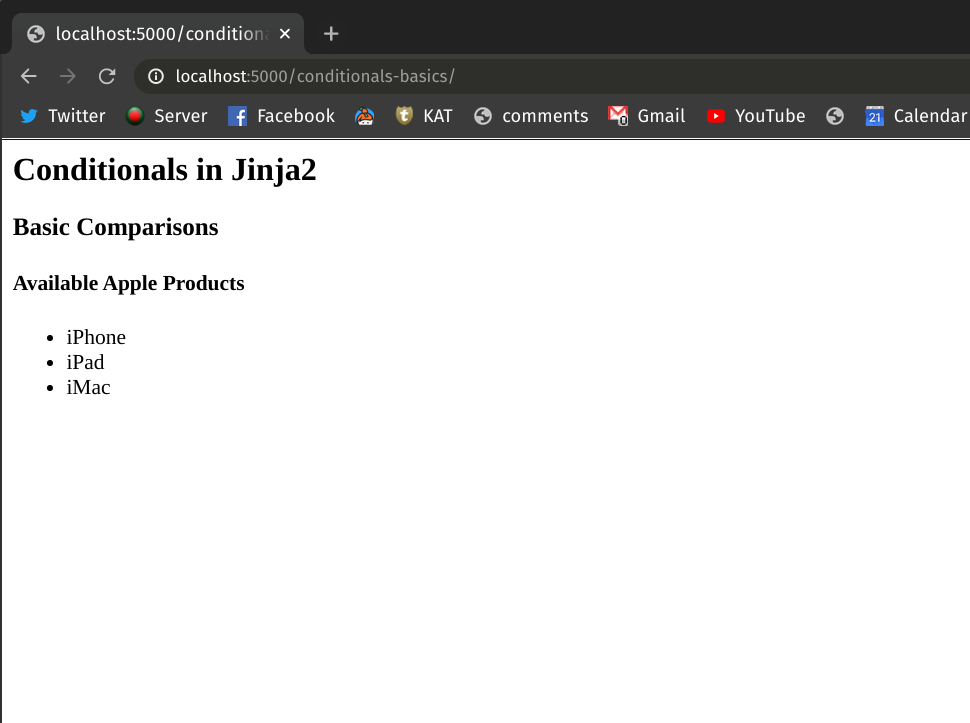
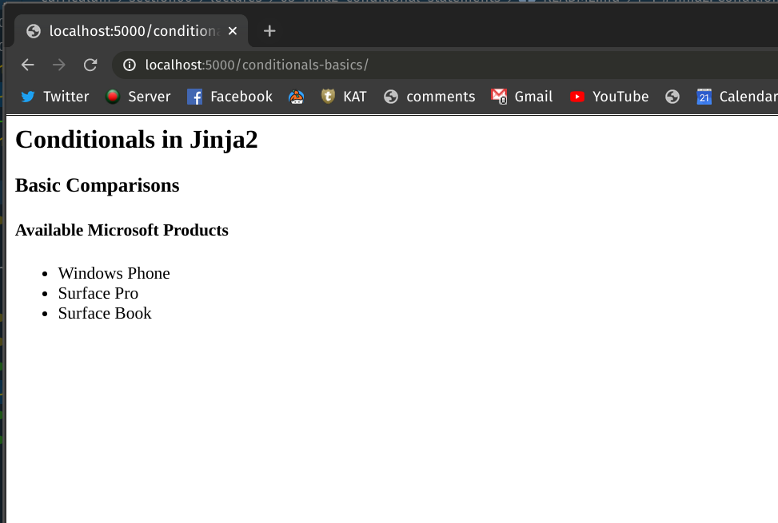
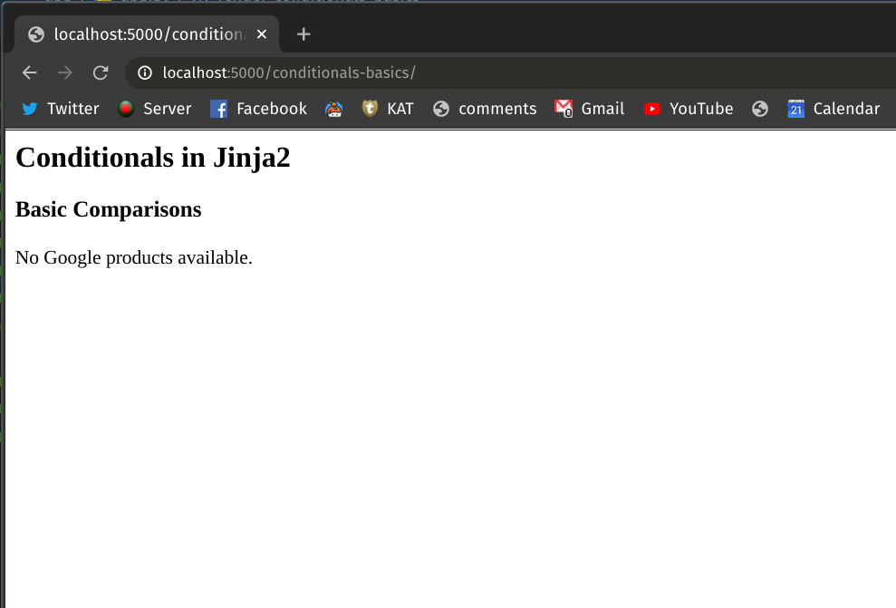
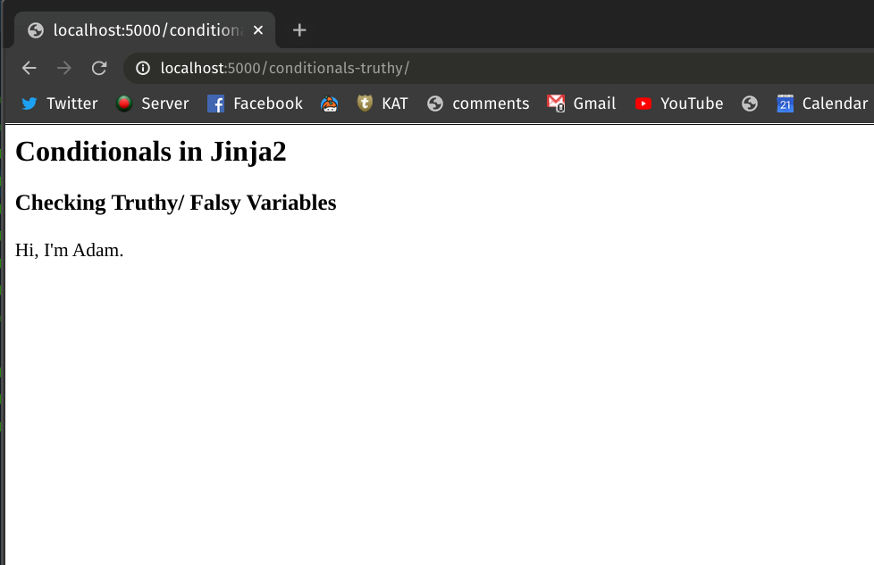
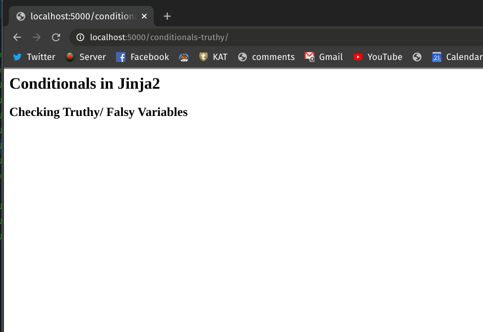

# Jinja2: Conditional Statements

**Conditional statements**[^conditional-statements] perform different computations or actions depending on whether a programmer-specified boolean condition evaluates to *true* or *false*. Simply speaking, the `if-else` construct in your code is generally referred to as conditional statements.

> Instead of dealing with `if...else` conditionals in the Flask code, you can directly embed them into the Jinja2 templates. With the default syntax, control structures appear inside `` blocks.

## Basic Comparisons

Define a template named `conditionals_basics.html` in your Flask project's `/templates` folder. In this example, we'll render different lists of products depending on the name of different companies provided by a user-defined variable called `company`. Here, we'll directly embed the conditional statements into the template.

```html{6,14,23,26}
<!-- templates/conditionals_basics.html -->

<h1>Conditionals in Jinja2</h1>
<h2>Basic Comparisons</h2>


    <h3>Available {{ company }} Products</h3>
    <ul>
        <li>iPhone</li>
        <li>iPad</li>
        <li>iMac</li>
    </ul>


    <h3>Available {{ company }} Products</h3>
    <ul>
        <li>Windows Phone</li>
        <li>Surface Pro</li>
        <li>Surface Book</li>
    </ul>


    No {{ company }} products available.


```

Notice how we added conditional blocks to the template via `` blocks in line 6, 14 and 22. The `` block in line 25 marks the end of the conditional block. Now let's create an endpoint named `/conditionals-basics/` in your Flask project's `app.py` file to render the template:

```python{10,11}
# app.py

from flask import Flask, render_template

app = Flask(__name__)


@app.route("/conditionals-basics/")
def render_conditionals_basics():
    company = "Apple"
    return render_template("conditionals_basics.html", company=company)
```

In line 10, we've provided the name of the company and passed that to the `render_template` method in the next line. Run the Flask application and go to [http://localhost:5000/conditionals-basics](http://localhost:5000/conditionals-basics) on your browser. You should be able to see the following list:



Now change the variable `company` in the `app.py` from `Apple` to `Microsoft` and see what happens. Your `app.py` should look like this:

```python{10}
# app.py

from flask import Flask, render_template

app = Flask(__name__)


@app.route("/conditionals-basics/")
def render_conditionals_basics():
    company = "Microsoft"
    return render_template("conditionals_basics.html", company=company)
```

This time going to the [http://localhost:5000/conditionals-basics](http://localhost:5000/conditionals-basics) on your brwoser should show a different list of products.



If you assign a different name other than `Apple` and `Microsoft` to the variable `company`, you'll see a "No product available" page.



## Checking Truthy / Falsy Values

You can also use conditional statements to test if a variable is *truthy*[^truthy-falsy] (or *falsy*) and take action based on that. For a variable to be *truthy*, it has to be defined, not empty and not false. Make a new template named `conditionals_truthy.html` and add the following contents to it:

```html{6,8}
<!-- templates/conditionals_truthy.html -->

<h1>Conditionals in Jinja2</h1>
<h2>Checking Truthy / Falsy Variables</h2>


    <p>Hi, I'm {{ user.username }}.</p>

```

The above template first checks whether the variable `user` is *truthy* and then it also checks whether attribute `user.username` is also a *truthy* value. If both of the conditions are true, the template returns the name defined in the `user` class.

Let's define an endpoint named `/conditionals-truthy` in the `app.py` file:

```python{8,19}
# app.py

from flask import Flask, render_template

app = Flask(__name__)


class User:
    def __init__(self, username):
        self.username = username

    def __repr__(self):
        return f"User({self.username})"


@app.route("/conditionals-truthy/")
def render_conditionals_truthy():
    user = User("Adam")
    return render_template("conditionals_truthy.html", user=user)
```

In line 8, we've defined a class called `User`. The class takes a single argument `username`. An instance of the class has been created in line 18. Here, the value of the argument `username = "Adam"` is *truthy*.

Run the Flask application and head over to [http://localhost:5000/conditionals-truthy](http://localhost:5000/conditionals-truthy) in your browser. You should see the template gets rendered like this:




Now if you instantiate the class `User` with a *falsy* value - for example, an empty string `""` - the greeting statement of the template won't be rendered. Here, your `app.py` will look like this:

```python{8,19}
# app.py

from flask import Flask, render_template

app = Flask(__name__)


class User:
    def __init__(self, username):
        self.username = username

    def __repr__(self):
        return f"User({self.username})"


@app.route("/conditionals-truthy/")
def render_conditionals_truthy():
    user = User("")
    return render_template("conditionals_truthy.html", user=user)
```

This time if you go to the [http://localhost:5000/conditionals-truthy](http://localhost:5000/conditionals-truthy), you'll notice that the greeting statement hasn't been rendered.




## Conclusion

In this post, you've learned how to perform basic comparisons in Jinja2 templates using conditional statements. You've also seen how you can leverage *truthy* and *falsy* values of variables to control your logic directly from the Jinja2 template.

[^conditional-statements]: [Conditional (computer programming)](https://en.wikipedia.org/wiki/Conditional_(computer_programming)#:~:text=In%20computer%20science%2C%20conditional%20statements,evaluates%20to%20true%20or%20false.)

[^truthy-falsy]: [What is Truthy and Falsy? How is it different from True and False?](https://stackoverflow.com/questions/39983695/what-is-truthy-and-falsy-how-is-it-different-from-true-and-false)
