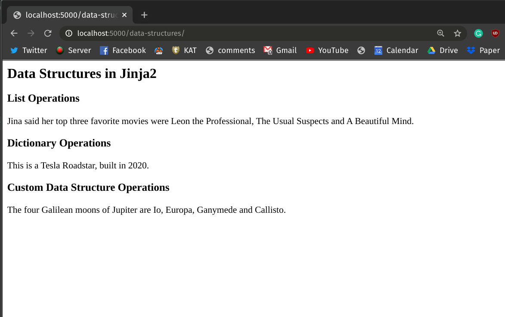

## Data Structures in Jinja2

Jinja2 templating language also lets you use Python's built-in or user defined data structures inside a template. This can give you a lot of power since it means you can basically define many valid Python operations inside an HTML template and the template engine will evaluate that.

Let's see how you can perform various operations using Python's built-in data structures like **list**, **dict** as well as user-defined data structures like **custom classes** in an HTML template.

Create a new HTML template named `data_structures.html` in the `/templates` folder and add the following contents to it:

<!-- Lines to highlight: 8, 9, 15, 16, 22, 23 -->

```html
<!-- templates/data_structures.html -->

<h2>Data Structures in Jinja2</h2>

<h3>List Operations</h3>

<p>
    Jina said her top three favorite movies were {{ movies[0] }},
    {{ movies[1] }} and  {{ movies[2]}}.
</p>

<h3>Dictionary Operations</h3>

<p>
    This is a {{ car["brand"] }} {{ car["model"] }}, built
    in {{ car["year"] }}.
</p>

<h3>Custom Data Structure Operations</h3>

<p>
    The four Galilean moons of Jupiter are {{ moons.first }},
    {{ moons.second }}, {{ moons.third }} and {{ moons.fourth }}.
</p>
```

<!-- Here, in the above HTML file, the highlighted line show operations concerning a *list*, *dict* and a *custom class* respectively. -->

To understand how the values will get filled, let's define a new endpoint named `/data-structures/` in the `app.py` file and add the necessary logics to fill in the placeholders mentioned in the `data-structures.html` file:

<!-- Lines to highlight: 34 -->

```python
from flask import Flask
from flask import render_template

app = Flask(__name__)

# define custom data structure with a class
class GalileanMoons:
    def __init__(self, first, second, third, fourth):
        self.first = first
        self.second = second
        self.third = third
        self.fourth = fourth


@app.route("/data-structures/")
def render_data_structures():

    # list operations
    movies = [
        "Leon the Professional",
        "The Usual Suspects",
        "A Beautiful Mind"
    ]

    # dictionary operations
    car = {
        "brand": "Tesla",
        "model": "Roadstar",
        "year": "2020",
    }

    # custom data structure operations
    moons = GalileanMoons("Io", "Europa", "Ganymede", "Callisto")

    kwargs = {
        "movies": movies,
        "car": car,
        "moons": moons,
    }

    return render_template("data_structures.html", **kwargs)
```

Here we've defined the list (`emotions`), dictionary (`car`) and a custom data structure with a class named `GalileanMoons`. In line **33**, we've created an instance `moon` of the custom class which is used in the template.

All these variables pointing to different data structures get picked up by the Jinja2 template engine and the `render_template` method renders them to your browser.

Just like the previous section, here too, we've passed the keyworded arguments to `render_template` method using dictionary unpacking operator `**`.

Run the Flask application and go to [http://localhost:5000/data-structures/](http://localhost:5000/data-structures/) in your browser. This should show the following HTML page:



Notice how all the placeholder data structure operations have been evaluated and filled in by the template engine.

## Conclusion

In this lesson you've learned how to use Python's built-in and user-defined data structures in HTML template files.