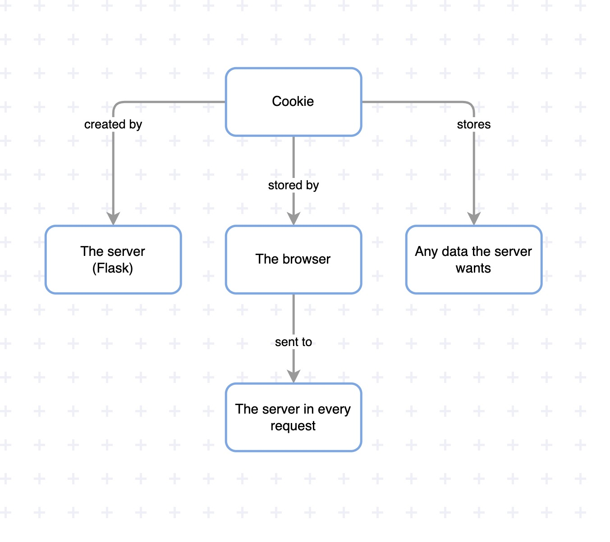
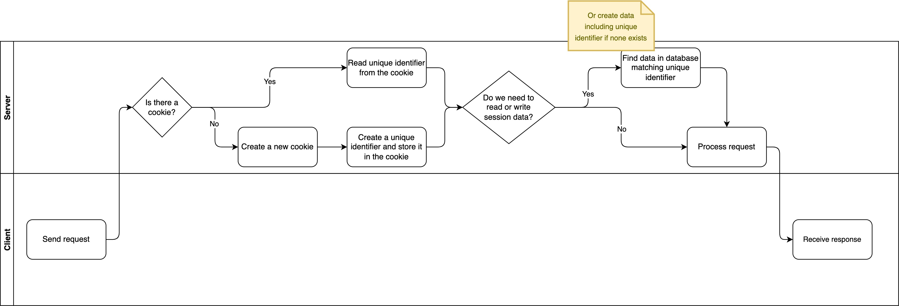

# What are cookies and sessions?

## Cookies

A **cookie** is a piece of data that is:

- Generated by your Flask app (automatically, you don't have to do anything)
- Stored by your web browser
- Sent by the browser to the Flask app in every request the browser makes

But **why**? It seems wasteful for Flask to generate a piece of data and then have the browser send it that same piece of data every request!

The reason: so that Flask doesn't have to remember information about the browser.

If you want your Flask app to "remember" something about a browser, you can put that data in the cookie.

The most obvious example is authentication. When a user (who is on a browser) logs in, you can put in the cookie "logged in".

Because each browser has its own cookie, you can just check every cookie when a browser sends it. If the cookie says "logged in", you know that that browser is logged in.

It's even better if you store _who logged in_ in the cookie. Then when you receive the cookie, you know which user is making the request.

## Session

A **session** is a term for the stored data related to a particular client. In our example above, data stored in the cookie is the "session data".

But session data doesn't have to be stored in cookies. It could be stored in a database, using the cookie solely as an identifier.

Sessions stored in the browser are called "client-side sessions". When stored in a database, they are called "server-side sessions".

Cookies are not 100% safe, so any user can look at the contents of the cookie. That is why we shouldn't store anything in the cookie that we wouldn't want the user to see.

That's one of the primary reasons for using a database instead.

Here's a quick data flow diagram for server-side sessions (you can enlarge by opening in a new tab):

